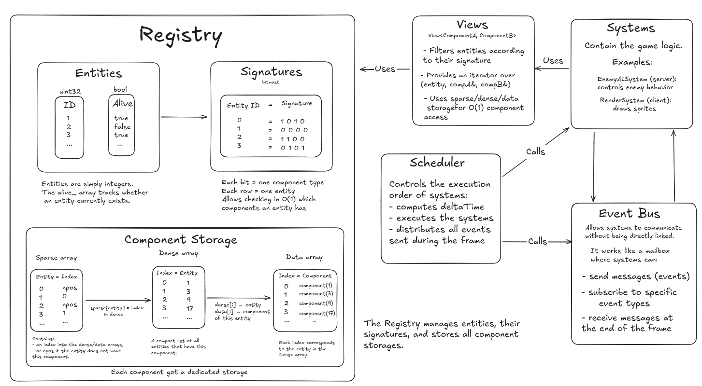
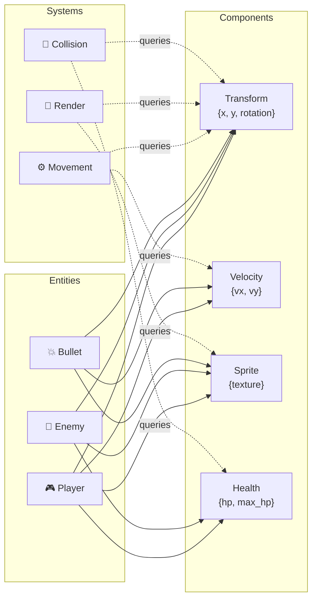
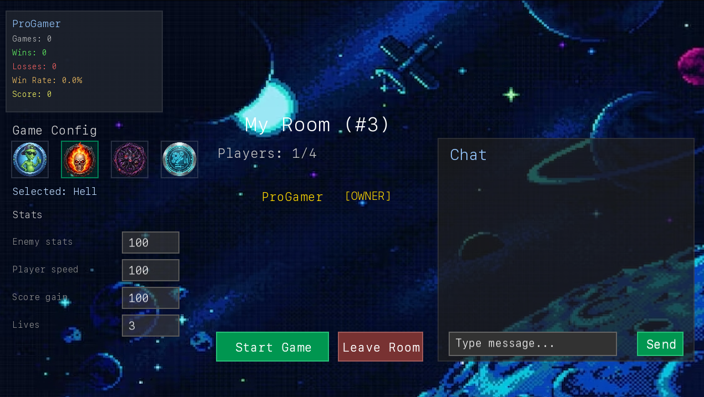
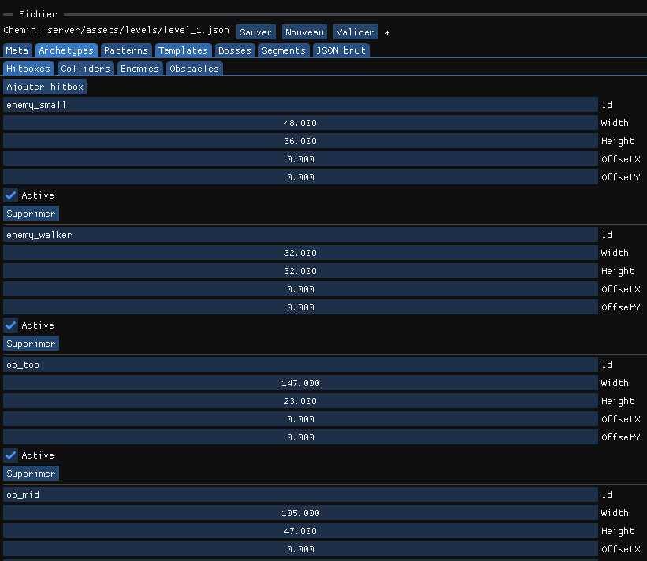

<p align="center">
  
</p>

<h1 align="center">R-Type</h1>

<p align="center">
  <b>🚀 A high-performance multiplayer space shooter engine built with C++20</b>
</p>

<p align="center">
  
  
  
  
</p>

<p align="center">
  <a href="#-quick-start">Quick Start</a> •
  <a href="#-features">Features</a> •
  <a href="#-architecture">Architecture</a> •
  <a href="#-documentation">Documentation</a> •
  <a href="#-contributing">Contributing</a>
</p>

---

<p align="center">
  
</p>

## ⚡ Quick Start

<table>
<tr>
<td width="50%">

### 📦 Prerequisites

| Tool | Version |
|------|---------|
| **C++ Compiler** | GCC 11+ / Clang 13+ / MSVC 2022+ |
| **CMake** | 3.16+ |
| **Git** | Latest |

</td>
<td width="50%">

### 🔧 Build & Run

```bash
# Clone & Build
git clone https://github.com/SimonDelcuze/rtype.git
cd rtype && cmake -B build -DCMAKE_BUILD_TYPE=Release
cmake --build build

# Launch
./r-type_server    # Terminal 1
./r-type_client    # Terminal 2
```

</td>
</tr>
</table>

> 💡 **First time?** Check our detailed [Installation Guide](docs/installation/README.md) for platform-specific instructions.

---

## 🎮 Features

<table>
<tr>
<td align="center" width="33%">
<h3>🚀 Custom ECS Engine</h3>
<p>Ultra-fast entity management with cache-friendly data structures and O(1) component access</p>
</td>
<td align="center" width="33%">
<h3>🌐 Netcode</h3>
<p>Client-side prediction & server reconciliation for smooth 60 FPS gameplay even with 200ms latency</p>
</td>
<td align="center" width="33%">
<h3>🛠️ Level Editor</h3>
<p>Visual tool to create, edit and share custom levels with drag-and-drop simplicity</p>
</td>
</tr>
<tr>
<td align="center" width="33%">
<h3>🛡️ Auth System</h3>
<p>Secure lobby with user accounts, persistent stats, ELO ranking and match history</p>
</td>
<td align="center" width="33%">
<h3>🎨 Dynamic Rendering</h3>
<p>Parallax scrolling, smooth animations, and high-fidelity VFX powered by SFML 3.0</p>
</td>
<td align="center" width="33%">
<h3>📊 Scalable Server</h3>
<p>Multi-threaded architecture supporting multiple concurrent game instances</p>
</td>
</tr>
</table>

---

## 🏗️ Architecture

Our engine is built on a custom **Entity Component System (ECS)** for maximum performance and flexibility.

<p align="center">
  
</p>

<details>
<summary><b>📐 How ECS Works</b> (click to expand)</summary>

<br>



| Concept | Description |
|---------|-------------|
| **Entity** | A unique ID representing any game object (player, enemy, bullet) |
| **Component** | Pure data attached to entities (Transform, Velocity, Health) |
| **System** | Logic that processes entities with specific component combinations |

</details>

---

## 📸 Screenshots

<table>
<tr>
<td align="center" width="33%">

<br><b>⚔️ Intense Combat</b>
</td>
<td align="center" width="33%">

<br><b>🛠️ Level Editor</b>
</td>
<td align="center" width="33%">

<br><b>🏠 Lobby System</b>
</td>
</tr>
</table>

---

## 📚 Documentation

Our documentation is organized by module for easy navigation.

<table>
<tr>
<td align="center" width="20%">

### 🚀
**[Getting Started](docs/installation/README.md)**
<br><sub>Build & Install</sub>

</td>
<td align="center" width="20%">

### 🏗️
**[Architecture](docs/architecture/README.md)**
<br><sub>ECS & Core Design</sub>

</td>
<td align="center" width="20%">

### 🌐
**[Network](docs/network/README.md)**
<br><sub>Protocol & Auth</sub>

</td>
<td align="center" width="20%">

### 🖥️
**[Server](docs/server/README.md)**
<br><sub>Threads & Levels</sub>

</td>
<td align="center" width="20%">

### 🕹️
**[Client](docs/client/README.md)**
<br><sub>Rendering & Input</sub>

</td>
</tr>
</table>

<details>
<summary><b>📖 Full Documentation Index</b></summary>

<br>

| Category | Topics |
|----------|--------|
| **Architecture** | [Core Components](docs/architecture/core-components.md) • [ECS Registry](docs/architecture/ecs/registry.md) • [Event Bus](docs/architecture/ecs/event-bus.md) • [Scheduler](docs/architecture/ecs/scheduler.md) |
| **Network** | [Protocol](docs/network/protocol/network-protocol.md) • [Delta State](docs/network/protocol/delta-state.md) • [Lobby Protocol](docs/network/protocol/lobby-protocol.md) • [Authentication](docs/network/authentication/README.md) |
| **Server** | [Game Instances](docs/server/game-instance-management.md) • [Level System](docs/server/levels/README.md) • [Thread Model](docs/server/threads/README.md) |
| **Client** | [Prediction](docs/client/prediction-reconciliation.md) • [Scene Graph](docs/client/scene-graph-layering.md) • [UI Menus](docs/client/ui/connection-menu.md) • [Animation](docs/client/assets/animation-manifest.md) |

</details>

---

## 📂 Project Structure

```
rtype/
├── 📁 client/          # Game client (SFML rendering, input, UI)
│   ├── include/        # Public headers
│   ├── src/            # Implementation
│   └── assets/         # Sprites, sounds, fonts
├── 📁 server/          # Authoritative game server
│   ├── include/        # Headers
│   └── src/            # Game logic, networking
├── 📁 shared/          # Common code (ECS, protocol, utils)
├── 📁 editor/          # Level editor tool
├── 📁 docs/            # Full documentation
├── 📁 tests/           # Unit & integration tests
└── 📁 scripts/         # Build & deploy utilities
```

---

## 🤝 Contributing

We welcome contributions! See our [Contribution Guidelines](CONTRIBUTING.md) for the full process.

```bash
# 1. Fork & Clone
git clone https://github.com/YOUR_USERNAME/rtype.git

# 2. Create feature branch
git checkout -b feature/awesome-feature

# 3. Make changes & commit
git commit -m "feat: add awesome feature"

# 4. Push & open PR
git push origin feature/awesome-feature
```

---

## 👥 Team

<table>
<tr>
<td align="center">
<b>Simon Delcuze</b>
</td>
<td align="center">
<b>Albin Vanden-Broeck</b>
</td>
<td align="center">
<b>Louis Truptil</b>
</td>
<td align="center">
<b>Ezio Decadt</b>
</td>
<td align="center">
<b>Charles Ignoux</b>
</td>
</tr>
</table>

---

<p align="center">
  <br>
  <sub>
    <a href="LICENSE">MIT License</a> •
    <a href="https://github.com/SimonDelcuze/rtype">GitHub</a>
  </sub>
</p>
