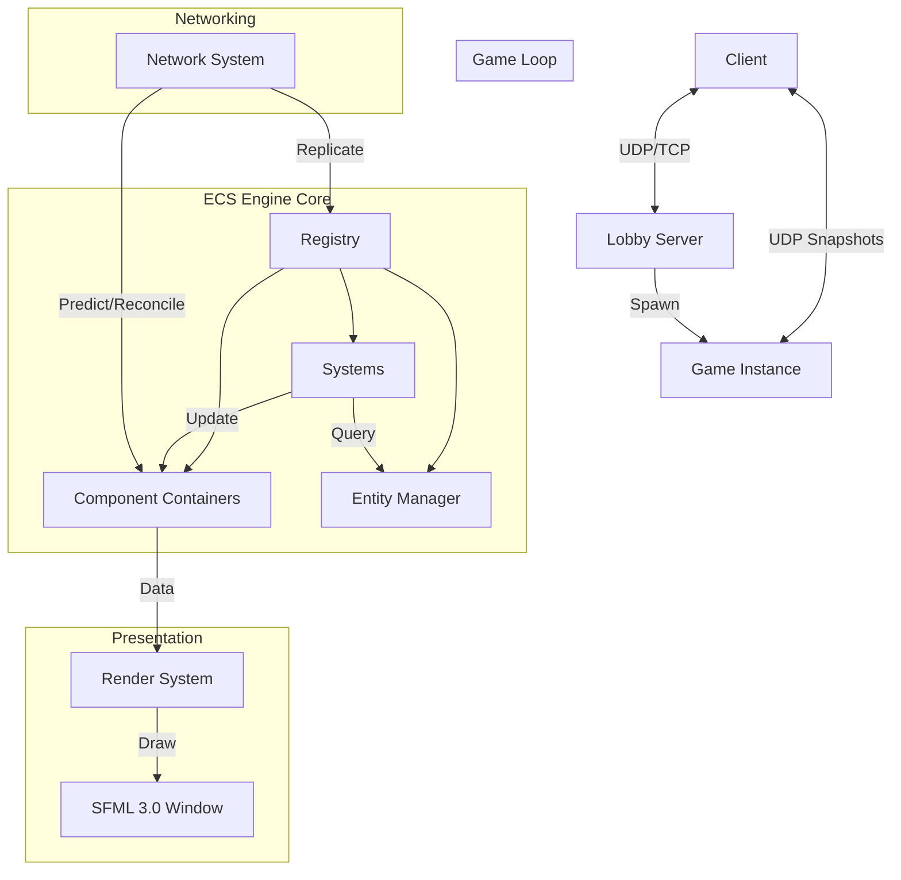

<p align="center">
  
</p>

<p align="center">
  <b>A high-performance, multiplayer space shooter engine built with C++20 and custom ECS.</b>
</p>

<p align="center">
  
  
  
  
</p>

---


## 🌌 Overview

**R-Type** is a modern reimagining of the classic arcade shooter, developed as a robust multiplayer engine. It features a custom-built **Entity Component System (ECS)**, a high-performance network protocol, and a scalable server architecture capable of handling multiple concurrent game instances.

### ✨ Key Features

- 🚀 **Custom ECS Engine**: Ultra-fast entity management with cache-friendly data structures.
- 🌐 **Multiplayer Synchronization**: Advanced client-side prediction and server reconciliation for lag-free gameplay.
- 🛠️ **Level Editor**: Create and share custom levels with a dedicated visual tool.
- 🛡️ **Secure Authentication**: Integrated lobby system with user accounts, statistics, and secure login.
- 🎨 **Dynamic Rendering**: Smooth animations, parallax scrolling, and high-fidelity visual effects powered by SFML 3.0.
- 📊 **Scalable Architecture**: Multi-threaded server design capable of hosting hundreds of players.

---

## 📸 Screenshots

<p align="center">
  <i>[ PLACEHOLDER: Insert Gameplay Screenshot 1 ]</i>
  <br>
  <i>[ PLACEHOLDER: Insert Level Editor Screenshot ]</i>
  <br>
  <i>[ PLACEHOLDER: Insert Lobby Menu Screenshot ]</i>
</p>

---

## 🏗️ Architecture & ECS Flow

The project leverages a custom **Entity Component System (ECS)** to decouple data from logic, ensuring maximum performance and scalability.



- **Registry**: The central hub managing entities and their associated components.
- **Systems**: Logic units that process entities with specific component signatures (e.g., `RenderSystem`, `PhysicsSystem`).
- **Components**: Pure data structures (POD) attached to entities.

---

## 📚 Documentation

Our documentation is extensive and organized for developers of all levels.

| Section | Description |
| :--- | :--- |
| 🚀 [**Installation**](docs/installation/README.md) | How to build and run the project on Linux, macOS, and Windows. |
| 🏗️ [**Architecture**](docs/architecture/README.md) | Deep dive into the ECS, Core Components, and Engine design. |
| 🌐 [**Network**](docs/network/README.md) | Detailed protocol specifications, authentication, and security. |
| 🖥️ [**Server**](docs/server/README.md) | Server-side logic, thread management, and level systems. |
| 🕹️ [**Client**](docs/client/README.md) | Rendering pipeline, UI module, and client-side prediction. |

---

## 🛠️ Quick Start

### Prerequisites

- **C++20** compatible compiler (GCC 11+, Clang 13+, MSVC 2022+)
- **CMake** 3.16+
- **Git**

### Build Instructions

```bash
# Clone the repository
git clone https://github.com/SimonDelcuze/rtype.git
cd rtype

# Configure and build
cmake -S . -B build -DCMAKE_BUILD_TYPE=Release
cmake --build build

# Run the server
./r-type_server

# Run the client
./r-type_client
```

---

## 🤝 Contributing

Contributions are welcome! Please check our [Contribution Guidelines](CONTRIBUTING.md) and [Code of Conduct](CODE_OF_CONDUCT.md).

1. Fork the Project
2. Create your Feature Branch (`git checkout -b feature/AmazingFeature`)
3. Commit your Changes (`git commit -m 'Add some AmazingFeature'`)
4. Push to the Branch (`git push origin feature/AmazingFeature`)
5. Open a Pull Request
