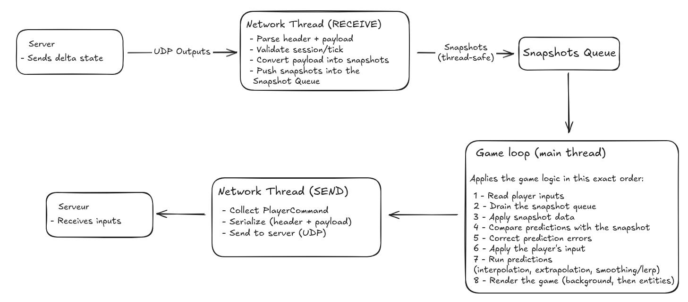

# Architecture Overview

The client architecture is designed to provide a smooth, visually stable representation of the authoritative server state while remaining responsive to user input.\
While the server controls all gameplay outcomes, the client performs several local tasks to hide latency, maintain visual consistency, and produce a responsive experience.

This page explains the overall structure of the client, how each subsystem interacts, and how the ECS integrates with the multithreaded networking pipeline.

***

### **1. High-Level Architecture**

The client is composed of four major subsystems:

#### **1. Networking**

Handles:

* Sending user inputs to the server over UDP
* Receiving authoritative snapshots
* Managing packet ordering and validation
* Buffering unprocessed packets

Networking runs on dedicated threads to avoid blocking rendering or simulation.

#### **2. Replication Layer (Authoritative State Sync)**

Responsible for:

* Applying authoritative snapshots
* Creating and destroying entities according to server data
* Updating transforms, health, and remote entity states
* Preparing interpolation buffers

No gameplay logic occurs here.\
The replication layer strictly synchronizes client-side ECS data with the server.

#### **3. Prediction & Reconciliation**

Handles only the **local player**:

* Immediately applies local inputs (prediction)
* Stores each input in a local history buffer
* Reconciles predicted state when authoritative state arrives
* Replays unconfirmed inputs after correction

This ensures responsive gameplay even with network latency.

#### **4. Rendering Pipeline**

Runs every frame and uses ECS visual components to draw:

* Entities
* Animations
* Sprites
* Backgrounds
* UI

Rendering is isolated from the main logic and does not affect gameplay or networking.

***

### **2. Diagram – Client Global Architecture**

<figure><figcaption></figcaption></figure>

***

### **3. Detailed Data Flow**

#### **Step 1 – Input Capture (Main Thread)**

* The client polls keyboard/gamepad input
* Encodes them as input commands
* Sends them to the networking send queue
* Applies them immediately to the predicted player

Inputs never block on server confirmation.

***

#### **Step 2 – Receiving Snapshots (Receive Thread)**

* The server sends authoritative snapshots at a fixed rate
* The UDP receive thread collects raw datagrams
* Packets are validated (sequence ID, type, size, etc.)
* Valid packets are pushed into a thread-safe queue
* The main thread later applies them during ECS update

The receive thread does **not** modify ECS state.

***

#### **Step 3 – Replication (Main Thread)**

When the main thread processes pending snapshots:

* New entities are created
* Old entities are destroyed
* Remote entity transforms and states are updated
* Interpolation buffers are updated
* Local player authoritative state is applied and reconciled

Replication ensures perfect alignment with the server.

***

#### **Step 4 – Prediction & Reconciliation (Main Thread)**

For the local player:

* Predicted movement is applied instantly
* Snapshot correction may override prediction
* All unconfirmed inputs are replayed
* The player state remains both responsive and authoritative

Remote entities never use prediction.

***

#### **Step 5 – Interpolation (Rendering Step)**

To smooth remote entity motion:

* Store last two authoritative states
* Compute interpolation factor based on render time
* Output visually smooth transform values

This prevents jitter caused by:

* latency spikes
* packet arrival irregularities
* UDP reordering

Interpolation is applied only to entities **not controlled locally**.

***

#### **Step 6 – Rendering Pipeline (Main Thread)**

Every frame:

* Update animations
* Update sprite frames
* Compute draw order
* Apply interpolated transforms
* Draw all visible objects and UI

The rendering pipeline uses only visual ECS components.

***

### **4. ECS Integration in the Client**

The client uses ECS exclusively for:

* visual representation
* interpolation
* animation
* local prediction buffers
* replicated authoritative data

The client ECS contains:

* visual components (sprites, animations)
* interpolated transforms
* predicted local player state
* temporary replicated data from snapshots

The client **does not** contain gameplay systems.\
Only the server executes real gameplay logic.

Client systems include:

* AnimationSystem
* InterpolationSystem
* PredictionSystem
* RenderingSystem

These systems ensure smooth visuals and responsive control.

***

### **5. Design Goals**

The client architecture was designed with the following goals:

#### **Responsiveness**

Local prediction prevents input delay.

#### **Visual Stability**

Interpolation produces smooth movement regardless of network instability.

#### **Separation of Concerns**

Networking, replication, prediction, and rendering are fully isolated.

#### **Scalability**

The client can display:

* large numbers of entities
* complex animations
* frequent snapshot updates\
  without stalling the main loop.

#### **Robustness**

Malformed packets, lag spikes, or dropped frames never crash or corrupt the ECS world.
